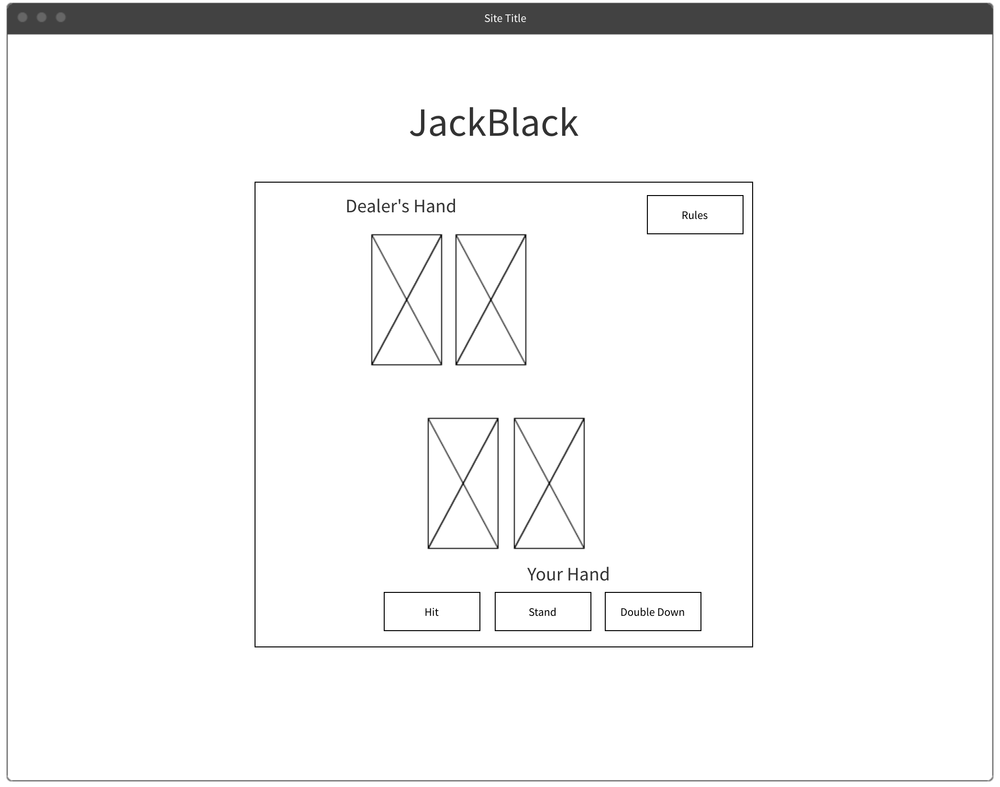

<h1>JackBlack</h1>
<h2>Background</h2>
    

    JackBlack is my version of a very popular casino game, BlackJack.BlackJack or 21 is a 
    common card game played in casinos. The goal of the game is to draw cards to obtain a 
    value of 21. Your opponent will be the dealer who is also trying to reach
    21. However, if the value of your hand exceeds 21, you automatically lose. This is called 
    "busting".
    

<h2>
Functionality And MVPs
</h2>
    
In the is game you will be able to :

    <ul>
        <li> Bet any amount against a dealer</li>
        <li> Hit more cards or Stand</li>
        <li> split cards</li>
        <li> Double Down on one card</li>
        <li> Have fun! </li>
    </ul>
    <a href="https://bicyclecards.com/how-to-play/blackjack/"> HERE is a more indepth look at the game.</a>

<h2>
Wireframes
</h2>
    
<h2>
Technologies
</h2>
    

    The Technologies I will be using are Vanilla JavaScript, HTML, and CSS.
    

<h2>
implementation Timeline
</h2>
    <ul>
        <li>Friday: I will be doing research on the tools i need for this project</li>
        <li>Monday & Tuesday: I will be figuring out the logic for the game and coding the functionality</li>
        <li>Wednesday: I will be using html and css to style my page </li>
        <li>Thursday: I will be making some minor adjustments</li>
    </ul>

